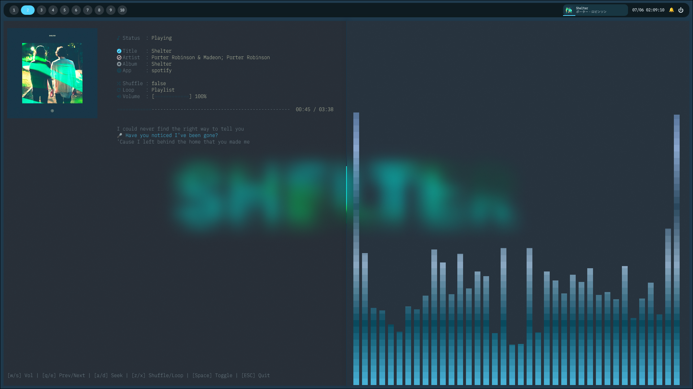
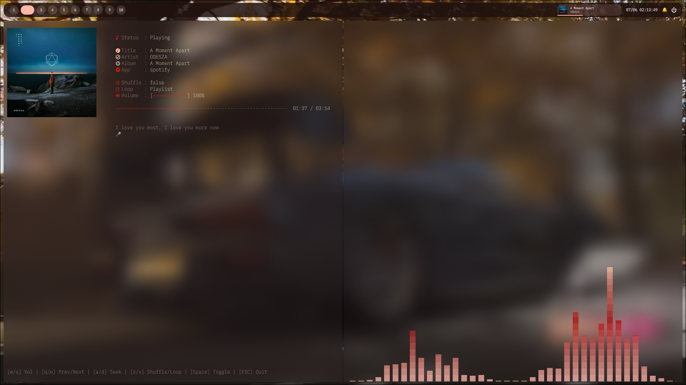

# go-music-tui
a beautiful tui music viewer with playerctl written in Go

> [!NOTE]
> This project is Fully Vibe-coding with Gemini/gh copilot

## Todo
- [x] Live Lyrics from lrclib
- [x] kitty album art
- [ ] Customizable KeyConfig
- [ ] TTY Color support
- [ ] No Lyrics mode
- [ ] No Album-art mode
- [ ] click-able UI
- [ ] Support CJK characters
- [ ] Move into a named TUI platform (I will. maybe)
- [ ] AUR Support(at this timing, AUR Registration is temporarily closed by Spam :/)
## Install / How to setup?

### Before running the project, make sure you have the following requirements installed:
- **playerctl** (Mac is not supported)
- **Go(1.26+ Recommended)**
- **Terminal supported kittyimg (kitty recommended)**
- matugen(advanced)
- **any MPRIS supported Player (Recommend mpv+mpv-mpris or spotify, Firefox and Firefox-Fork suck at providing artwork)**
- **any Nerd Fonts**
## Auto Install With Go (Recommended)
```bash
go install github.com/dot-1245/go-music-tui@latest
```
## Manual Install
### Step 1: clone this repo 

using https
``` bash
git clone https://github.com/dot-1245/go-music-tui.git
```

using ssh
``` bash
git clone git@github.com:dot-1245/go-music-tui.git
```

**using github CLI (recommended)**
```bash
gh repo clone dot-1245/go-music-tui
```

### Step 2: Enter into repo folder and Build
```bash
cd go-music-tui
go build
./go-music-tui
```
or simply just try it without building
```bash
cd go-music-tui
go run main.go
```
> [!NOTE]
> if you want to send it to other folder, use `-o` options in build

### Step 3: Have fun!

## Advanced: How To use Matugen on this project?
This TUI reads ~/matugen-colors.txt and uses these four Color:
```
primary #ffffff
source_color #4285f4
on_error_container #ffdad6
outline #919191
```
so you can use matugen or any software to change color to anything you want (wallpaper, artwork, anything!)

> [!WARNING]
> it's based on my system, it may cause bugs / mess up your nice Rice due to incorrect paths. Be Careful With ALL Step! Please Read and Verify All commands Before Run!

First, Move to Matugen templates folder (in my system, it's on ~/.config/matugen/templates )
```bash
cd ~/.config/matugen/templates
```

Next, Copy Template File from Repo
For Example:
```bash
curl -O https://raw.githubusercontent.com/dot-1245/go-music-tui/main/colors.txt
```
(make sure you're on templates folder)

Next, Edit matugen config files (in my system, it's on ~/.config/matugen/config.toml)
```bash
cd ..
cat << 'EOF' >> ~/.config/matugen/config.toml

[templates.colors_cache]
input_path = '~/.config/matugen/templates/colors.txt'
output_path = '~/matugen-colors.txt'
EOF
```

Done! Enjoy!

## LICENSE:
[GPL v3.0](LICENSE)
